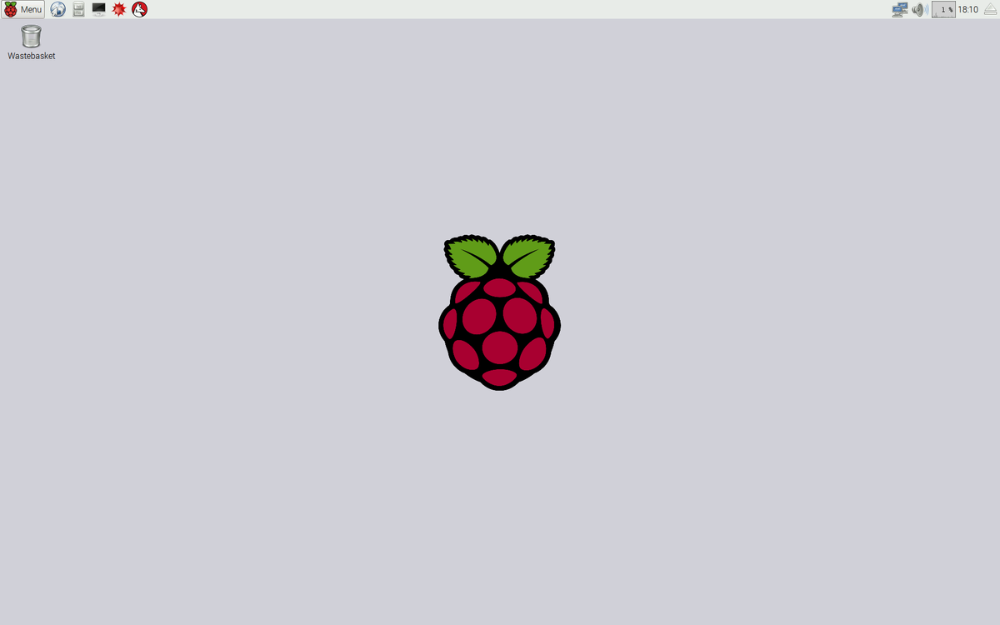
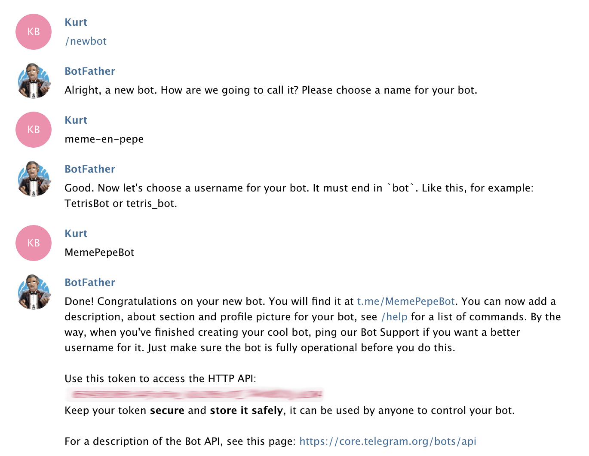
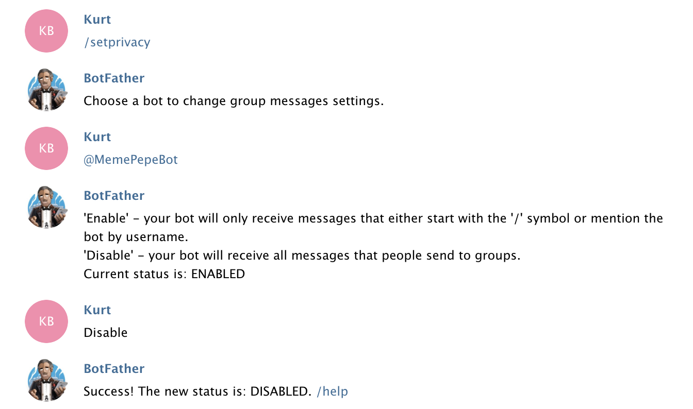

__Disclaimer:__ De FamilieKiosk gebruikt [Telegram](https://web.telegram.org), en werkt dus slechts zolang de API van `Telegram` niet wijzigt en `Telegram` dit type gebruik toelaat. We doen ons best ondersteuning te bieden, maar kunnen hiertoe niet verplicht worden.

Je hebt een familiekiosk ontvangen. Dit omvat een doos met knoppen en een Raspberry Pi. Connecteer de delen als volgt:

1. Klik de kabel van de familiekiosk doos met knoppen aan de Raspberry Pi via de connector. 
2. Gebruik de HDMI kabel om de Raspberry Pi aan de TV te koppelen. 
3. Voor de eerste installatie moeten we nog enkele gegevens invullen. Hiertoe heb je een USB muis en toetsenbord nodig. Connecteer deze in de USB slots van de Raspberry Pi
4. De microUSB poort van de Raspberry Pi is om stroom te leveren. Plug de stroomkabel daar in, en plug deze in een stopcontact. __Opgelet: De TV moet aan zijn en de HDMI kabel ingeplugd voor je je Raspberry stroom heeft. Anders zul je geen beeld zien (Rasp start headless op).__

De Raspberry Pi start op, en toont onmiddelijk de Kiosk met de standaard foto. Om de Kiosk af te sluiten klik je op de __Linkermuis__ knop. Je bekomt dan de desktop: 



## Wifi Netwerk instellen

De Raspberry Pi beschikt over WiFi welke we gebruiken om met het internet te connecteren en nieuwe multimedia te bekomen voor de Kiosk. Je dient dus het netwerk in te stellen voor de locatie waar de familiekiosk opgezet wordt. Klik hiervoor in de rechterbovenhoek op het icoon van het netwerk, selecteer de SSID van je wifi netwerk, en geef je paswoord op. 

## Installeer Telegram, aamaken bot en configureren van de bot

De Kiosk werkt via een chatbot op [Telegram](https://telegram.org/) een chatapp met dezelfde functies als WhatsApp, maar met de mogelijkheid om er extra code voor te schrijven via bots. 

Net zoals bij Whatsapp, kan je via telegram groepsgesprekken hebben. De bot die je gaat maken, zal ook deel uitmaken van deze groep en de gedeelde foto's, video's en audioboodschappen automatisch kopiëren naar de familiekiosk.

1. Installeer [Telegram](https://telegram.org/) op je smartphone. 

Elke Familiekiosk moet zijn eigen _geheime_ chatbot hebben. Je gaat dus voor je eigen kiosk een chatbot aanmaken, deze configureren en toevoegen aan het groepsgesprek waar de rest van je familie in zit.

Bedenk een goede naam voor je bot, in deze handleiding gebruiken we ```MemePepeBot```. Wijzig deze door je eigen naam!

Het aanmaken en configureren van een bot gebeurt ook via Telegram door te praten met de chatbot ```@BotFather```.

Je kan dit doen via de telegram app op je smartphone, maar je kan ook via via [web.telegram.org](https://web.telegram.org) telegram openen. Voor de rest van deze handleiding gaan we er van uit dat je via de web-interface werkt.

2. Log in op [web.telegram.org](https://web.telegram.org)
3. Praat met ```@BotFather``` door te klikken op volgende link: [web.telegram.org/#/im?p=@BotFather ](https://web.telegram.org/#/im?p=@BotFather)
4. In het gesprek met ```@BotFather``` vraag je een nieuwe bot aan met volgend commando: ```/newbot``` De volledige conversatie ziet er ongeveer zo uit. Kies uiteraard een andere naam ;)



Je hebt nu een bot gemaakt!

De token (het wachtwoord bestaande uit de rode letters en cijfers) kopiëer je en hou je even bij. Je hebt dit straks nodig in het configuratiebestand van de familiekiosk applicatie. Hou het voor de rest zeker geheim en geef het aan niemand anders door.

Een volgendestap is nodig om je bot de mogelijkheid te geven om te luisteren naar alles wat er gezegd wordt in een chatgroep en niet alleen de commando's (die beginnen met een /).

5. Geef volgende commandoreeks één voor één in (of je kiest een antwoord na het eerste commando via de keuzeknoppen die @BotFather aanbiedt)

```
/setprivacy
@MemePepeBot
disable
```

De conversatie ziet er dan ongeveer als volgt uit:



Als laatste stap moet je de bot toevoegen aan de chatgroep waar de rest van de familie ook in kan komen (of al in zit).

6. Voeg deze bot toe aan de chatgroep, net zoals je elke andere gebruiker van Telegram zou toevoegen.


## Familie Kiosk instellen

De configuratie van de Kiosk is in bestand `/home/pi/familiekiosk/src/config.py`. Maak dit bestand aan door het basisbestand te kopieren. Je kan bestand `/home/pi/familiekiosk/src/config.py.in` openen met tekstverwerker `thonny` en opslaan als `config.py` in dezelfde map, of start een Terminal en gebruik de commando's:

	cp /home/pi/familiekiosk/src/config.py.in /home/pi/familiekiosk/src/config.py
	thonny /home/pi/familiekiosk/src/config.py

Bovenaan dit bestand moet je het __TOKEN__ van je chatbot geven, en een paswoord instellen van de chatbot:

	# the token of your bot obtained from Telegram
	TOKEN = "YOUR_TELEGRAM_BOT_TOKEN"
	# the password required to listen to the chatgroup
	PASSWORD = "FK_TEST"

Wijzig ```FK_TEST``` in een _goed_ paswoord! Iedereen die dirt wachtwoord kent, zal foto's kunnen sturen naar je kiosk kan sturen. Omdat in principe iedereen over heel de wereld met de bot zou kunnen praten, is deze extra beveiliging ingebouwd.

De andere opties die je mogelijks wil wijzigen zijn:

1. Als geen knoppen, wijzig dan de knop van ```True``` naar ```False``` 
2. Als geen buzzer, wijzig dan ```BUZZER_PRESENT``` in ```False```
3. De tijd van het alarm staat op 18u. Dan zal voor 30 min de meest recente foto's, audio en video getoond worden. Om ander uur te kiezen, wijzig dit:
```
	ALARM_HOUR = 18
	ALARM_MIN = 0
```

Je kan nu de Raspberry Pi herstarten om de kiosk op te starten met de chatbot. 

## Berichten sturen naar de Kiosk
Om berichten te sturen, voeg je jouw gemaakte chatbot, hier ```MemePepeBot``` genoemd, toe aan een groep, of doe je er een rechtstreeks gesprek mee. Voordat de bot je berichten zal doorsturen naar de kiosk, moet je wel een keer het wachtwoord doorgeven. Doe dit als volgt:

1. zoek op je chatbot en voeg hem toe


2. test of de chatbox aan staat. Dit is het geval als de Raspberry Pi opgestart is. Indien niet, laat weten aan de eigenaar hem opnieuw in het stopcontact te steken! Je kan dit testen via het start commando in de chat waarop de chatbox met _Hi_ zal antwoorden:
```
	/start
```
3. Geef nu het paswoord via het __/secret__ commando, gevolgd door het paswoord welke je gekozen hebt. Hierna zal elke chat met multimedia een antwoord krijgen van de chatbot om aan te duiden dat die goed ontvangen werd
```
	/secret XXXXX_JOUW_GEHEIM_PASWOORD
````

Test nu de chatbot door een foto te sturen, of een video, of een audiofragment. Zie telegram documentie hoe dit te doen indien de interface niet duidelijk is.

## Beperkingen

1. Vooraleer de tvbox update en de __Next__ en __Previous__ knoppen werken moeten er twee foto's aanwezig zijn bij het opstarten. Bij slechts 1 foto blijft steeds die ene foto te zien. Bug [#1](https://github.com/TeamScheire/familiekiosk/issues/1)
2. Een kabel is nodig van de knoppenbox naar de Raspberry Pi bij de TV, kan dat niet zonder? Ja. Dan moet bv een nodeMCU en een batterij in de knoppenbox gestopt worden en via WiFi of bluetooth of IR gewerkt worden. Patches welkom, maar moet wel __eenvoudig__ blijven: connectie semi automatisch, batterij vervangen eenvoudig, ...

## Startfoto's opladen
Het is niet nodig startfoto's op te laden, maar wel handig dat de Kiosk iets heeft om te tonen van bij het begin. Startfoto's kun je op een usb stick plaatsen. Ze dienen extensie `.jpg` te hebben. Niets anders wordt aanvaard! 

Stop de usb stick in de Raspberry Pi, en copieer de foto's naar de map `/home/pi/familiekiosk/src/pics`. Deze foto's zullen getoond worden door de Kiosk. Opgelet, elke foto wordt enige tijd getoond. Zet dus ook niet teveel foto's op.

## Ruimte vrijmaken
Indien veel foto's, video's of audio naar de Kiosk gestuurd wordt, zal het nodig zijn na verloop van tijd ruimte vrij te maken. Connecteer een muis en toetsenbord aan de Raspberry Pi, en klik de linkermuisknop om de Kiosk te stoppen. 

Start de bestandenbeheerder vanuit de top menubalk, en verwijder de oudste multimedia bestanden uit de mappen

	/home/pi/familiekiosk/src/pics
	/home/pi/familiekiosk/src/video
	/home/pi/familiekiosk/src/voice
	
Je kan de multimedia verwijderen of op een stick plaatsen als backup. Opgelet, bij verwijderen, vergeet ook niet de vuilnisemmer (Wastebasket) te legen. Herstart de Raspberry hierna om de Kiosk terug te starten.
